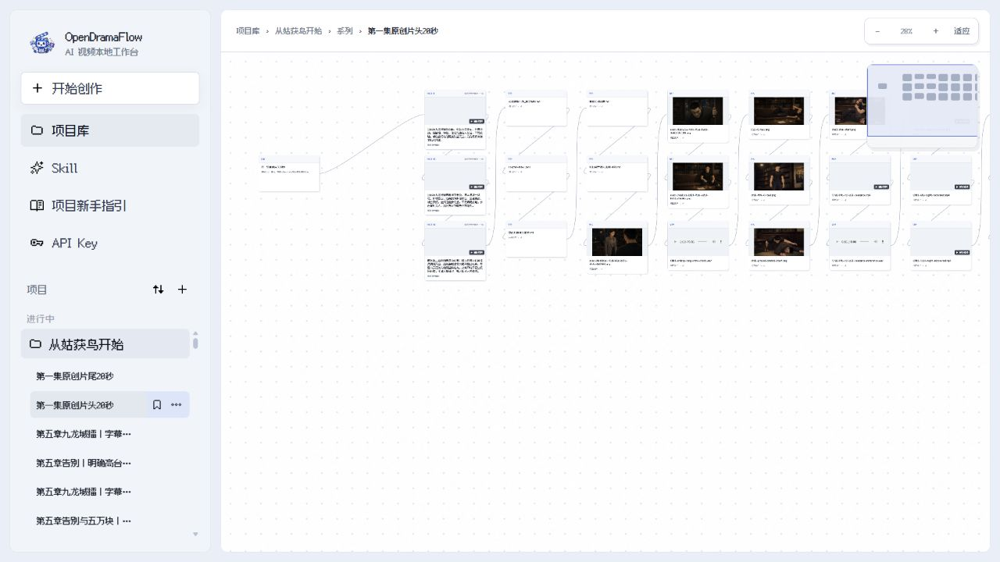
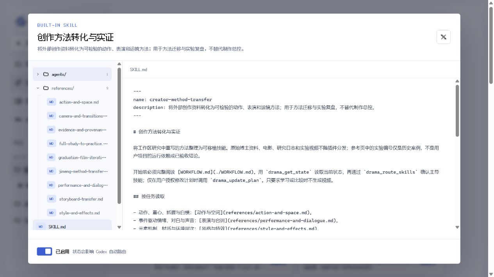
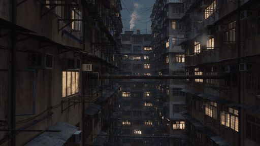
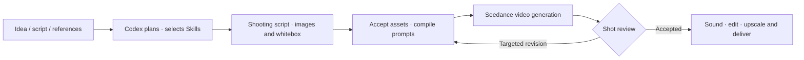
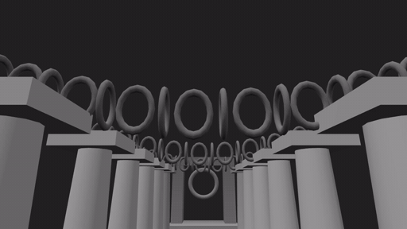

<p align="center">English · <a href="README_zh.md">简体中文</a></p>

<p align="center">
  
</p>

<h1 align="center">OpenDramaFlow</h1>

<p align="center"><strong>Your story. Codex in the director's chair.</strong><br />Turn ideas, scripts and references into video—inside Codex.</p>

<p align="center">
  
  
  
  
</p>

<p align="center"><a href="#showcase">Showcase</a> · <a href="#quick-start">Quick start</a> · <a href="#production-workflow">Workflow</a> · <a href="#built-in-skills">Skills</a> · <a href="#docs-and-development">Docs</a></p>

OpenDramaFlow is an open-source video production plugin for **Codex Desktop on Windows**. It connects specialist Skills, model APIs, versioned assets and local postproduction so Codex can organize a production from the initial brief to delivery.

**Create in the Codex conversation on the left; inspect assets and results in the plugin canvas on the right.** No manual node building or workflow wiring required.

## Why OpenDramaFlow

- **Conversation-led production.** Adapt a novel, make a short film or plan a product ad. Codex selects specialist Skills, writes shots and prompts, and calls the tools.
- **A visible production workspace.** Organize projects, volumes/seasons, creation pages and asset folders. Preview full images, play videos and follow relationships on an infinite canvas.
- **Built around Seedance.** Give image, video, audio and first/last-frame references distinct roles across generation, extension and editing.
- **Revise and resume.** Preserve asset versions, provider task IDs and production state. Repair affected shots without casually replacing accepted work.
- **Project-scoped memory.** Keep experimental lessons separate from approved facts so one experiment cannot silently rewrite a character or another project.



<details>
<summary>Project library and Skill browser</summary>




</details>

## Showcase

### 《从姑获鸟开始》城寨风云篇 · Episode 1

**[Watch on Douyin](https://v.douyin.com/rD_OP4_kMSI/)** · **[Watch on Xiaohongshu](https://www.xiaohongshu.com/discovery/item/6aa5351d0000000028029cea)**

[](https://v.douyin.com/rD_OP4_kMSI/)

A complete production case spanning character and scene design, generated shots, sound, editing and packaging.



### Before and after upscaling

**720p source on the left; local 4K upscale on the right.** Both panels show the same region of the same shot, synchronized.


[Original-resolution samples and processing details](production/publish-examples/README.md)

## Quick start

You need **Windows, Codex Desktop and Git**. The installer checks Node.js 20+, npm and FFmpeg and attempts to install missing dependencies. Video generation requires your own Ark API key; provider charges apply.

```powershell
git clone https://github.com/jiushiaaa/open-drama-flow.git
cd open-drama-flow
powershell -ExecutionPolicy Bypass -File .\scripts\install.ps1
```

Alternatively, open this repository in Codex and ask:

> Install OpenDramaFlow using scripts/install.ps1. Check dependencies and verify the plugin without paid generation or interrupting other production tasks.

After installation, open a new Codex task or restart Codex. Configure your Ark key in the workbench's **API Key** page. A Doubao Speech key is optional for standalone ASR/TTS. Credentials are protected with Windows DPAPI.

Then describe your first project in Codex:

> Use OpenDramaFlow to turn my story into a 15-second, 16:9 suspense short. Plan the events, characters and shots first. Use Codex's built-in image tool and import candidates only after I accept them. Make one video sample before continuing, and explain the expected model-call count first.

Automatic execution stays within the current objective and defined call limits; image admission and production memory retain their acceptance boundaries. Manual approval is available per project. Neither mode requires building canvas nodes by hand.

## Production workflow



1. **Direct before generating.** Codex turns source material and approved settings into a shooting script: events, dialogue, camera, action and continuity. Where useful, it writes a 3D whitebox for spatial and camera previsualization.
2. **Assign each reference a job.** The current Codex built-in image-gen tool is the default image entry point. Accepted images enter the library; prompts and appearance, motion, camera and sound references go to Seedance 2.5.
3. **Repair locally and deliver.** Review motion, identity, dialogue and subtitles, preserve accepted content, then organize sound, editing, optional upscaling and delivery. Lessons become candidates before approval into production memory.

Whitebox space and camera previsualization:



[Whitebox video and editable source](production/publish-examples/whitebox-camera/README.md) · [Production guide and tool setup](docs/production-guide.md)

## Built-in Skills

**47 built-in Skills: one producer and 46 specialists.** Codex routes tasks automatically, or you can name a Skill explicitly. Representative workflows are listed below; each name links to its full instructions.

| Skill | Responsibility | Good for |
| --- | --- | --- |
| [AI drama producer](plugins/ai-drama-studio/skills/ai-drama-producer/SKILL.md) | Planning, routing, production state and delivery | End-to-end orchestration |
| [Novel preproduction](plugins/ai-drama-studio/skills/novel-comic-drama-preproduction/SKILL.md) | Source organization, scripts, assets and director's storyboards | Long-form and volume-based adaptations |
| [Character and scene storyboards](plugins/ai-drama-studio/skills/character-scene-storyboard/SKILL.md) | Align character references, settings and story beats | Preproduction and shot planning |
| [Film shots and character cards](plugins/ai-drama-studio/skills/film-shot/SKILL.md) | Framing, camera position, lighting and blocking | Cinematic shots and identity consistency |
| [Seedance prompt expert](plugins/ai-drama-studio/skills/seedance-prompt-expert/SKILL.md) | Multimodal, first/last-frame, extension and editing prompts | Reference roles, sound and continuity constraints |
| [Brand ads](plugins/ai-drama-studio/skills/brand-ad/SKILL.md) | Materials, craftsmanship, logos and product heroes | Lightweight ads up to 15 seconds |
| [Anime and game PVs](plugins/ai-drama-studio/skills/anime-game-pv/SKILL.md) | Character, ensemble and world introductions | Game and event promos up to 15 seconds |
| [Cinematic titles and teasers](plugins/ai-drama-studio/skills/cinematic-title-sequence/SKILL.md) | Titles, cast, character action and suspense | Opening sequences and concept teasers |
| [Editing craft](plugins/ai-drama-studio/skills/clip-studio-craft/SKILL.md) | Rhythm, cuts, transitions, captions and speed | Refining an existing timeline |
| [Video deconstruction](plugins/ai-drama-studio/skills/video-deconstruct/SKILL.md) | Extract shot evidence and structure from references | Shot-by-shot analysis and prompt reconstruction |
| [Creator method transfer](plugins/ai-drama-studio/skills/creator-method-transfer/SKILL.md) | Turn tutorials and references into testable shot hypotheses | Motion, acting and camera experiments |

Skills provide professional workflows, not additional model capabilities. [Browse all Skills](plugins/ai-drama-studio/skills)

## Models and extensions

| Tool | Purpose | Integration |
| --- | --- | --- |
| Codex built-in image-gen | Characters, scenes and reference images | Default image tool; import after acceptance |
| Seedance 2.5 | Video, multimodal references, first/last frames, extension, editing and native sound | Plugin API adapter |
| Doubao Speech | Standalone recognition and standard TTS | Optional speech key; otherwise use Seedance for video sound |
| FFmpeg | Editing, mixing, captions, inspection and export | Local tool |
| [Real-ESRGAN](https://github.com/xinntao/Real-ESRGAN) | Local upscaling and restoration | Separate installation; 4K is a postproduction upscale |
| [Video Depth Anything](https://github.com/DepthAnything/Video-Depth-Anything) | Temporally consistent video depth references | Separate installation; experimental motion analysis |

Choose your Codex model; the plugin does not require a hard-coded version. SeedAudio 1.0 music production and ChatCut editing are independent extensions requiring extra setup, not bundled plugin services. [Configuration and capability boundaries](docs/production-guide.md#models-and-tools)

## Known limitations

- **Complex fights still need iteration.** Grips, fast exchanges, occlusion and weight shifts can fail. Whiteboxes and temporal depth do not replace skeletal motion capture or contact solving.
- **References are not hard constraints.** Multimodal generation and editing can alter identity or protected content. Longer productions still require cross-shot review and normal-speed viewing and listening.
- **Generation and local compute have costs.** Availability depends on account access, provider APIs and input conditions. Upscalers, depth models and optional plugins need separate setup.

## Docs and development

- [Production guide: models, acceptance and local data](docs/production-guide.md)
- [Plugin and MCP documentation](plugins/ai-drama-studio/README.md)
- [Public examples and reproducible assets](production/publish-examples/README.md)
- [Model and reference sources](docs/reference-sources.md)
- [Canvas components and build](plugins/ai-drama-studio/ui/README.md)
- [Contribution and working agreement](AGENTS.md)

Reproducible issues, workflow improvements and specialist Skills are welcome. Development checks make no paid model calls:

```powershell
cd plugins/ai-drama-studio
npm ci
npm run check
npm test
node scripts/sync-skill-manifest.mjs --check
node scripts/verify-skill-mcp.mjs
```

Software is [MIT licensed](LICENSE). The canvas uses React + TypeScript components from [infinite-canvas](https://github.com/basketikun/infinite-canvas), with upstream licensing and attribution retained. Third-party models, weights and creative assets retain their own licenses.
