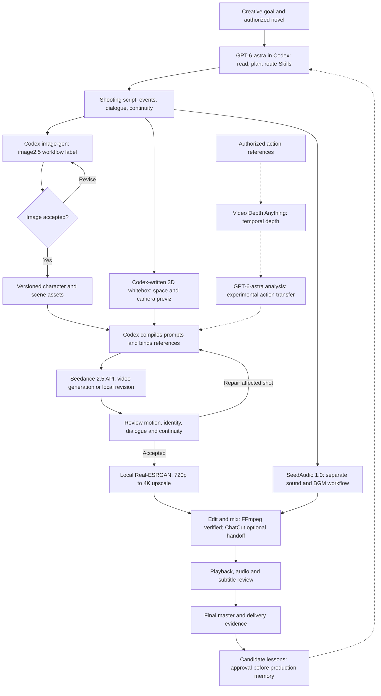

<p align="center"><a href="README_zh.md">简体中文</a></p>

<p align="center">
  
</p>

<h1 align="center">OpenDramaFlow</h1>

<p align="center">Your story. Codex in the director's chair.<br />A Codex-native, local-first video production harness for Windows.</p>

<p align="center">
  
  
  
  
</p>

<p align="center"><a href="#watch-a-real-production">Watch</a> · <a href="#agent-production-workflow">Workflow</a> · <a href="#the-workbench-today">Workbench</a> · <a href="#install">Install</a> · <a href="#known-limitations">Limitations</a></p>

Codex leads planning, specialist Skills, generation, media organization and editing. Describe the creative goal in your Codex conversation; the canvas shows the work without requiring you to build a node graph by hand.

## Watch a real production

**[《从姑获鸟开始》城寨风云篇 · Episode 1 — watch on Xiaohongshu](https://www.xiaohongshu.com/discovery/item/6aa5351d0000000028029cea)**

[](https://www.xiaohongshu.com/discovery/item/6aa5351d0000000028029cea)

Published by the creator **欧五花八蒙**. This is a real production case, including its imperfections—not a promise of one-click, first-pass quality. The external page may require Xiaohongshu sign-in or its app. The linked publication is supplied by the creator; this documentation update did not independently play the full online episode.

### A glimpse of the production


Six seconds selected from the existing opening: city → ring → chains. This lightweight, muted GIF is for motion preview, not image-quality evaluation. See the episode above for story, editing and sound.

[720p environment clip](production/publish-examples/ending-720p-4s.mp4) · [Same clip upscaled to 4K](production/publish-examples/ending-upscaled-4k-4s.mp4) · [Downloadable examples and provenance](production/publish-examples/README.md)

The README uses GIF for inline motion and Mermaid for the flowchart; MP4 files remain ordinary viewing/download links. **4K is a postproduction upscale, not native Seedance 4K.** Full episodes, source novels and third-party reference films are not bundled.

## Agent production workflow

This is the creator's evolving production recipe. The harness provides durable state and tools; Codex orchestrates them. Optional external tools and experiments are not all built-in MCP services.



1. **Assets first.** The creator calls the built-in image workflow **image2.5**; historical project records also say **image2**. These are workflow labels, not a guaranteed API model ID. Use the current Codex session's built-in image tool, show candidates, and import accepted images. Provider fallback requires explicit request or verified built-in failure.
2. **Direct before generating.** GPT-6-astra is the creator's selected Codex model, not a required model hardcoded into the plugin. It writes shooting scripts and code for 3D previz; a renderer such as Three.js produces whitebox video. Whitebox references control space, camera paths and timing—not reliable fine-grained fight choreography.
3. **Generate with explicit references.** Codex sends prompts plus role-bound images, videos, audio and/or boundary frames to Seedance 2.5. Keep appearance, motion, camera and sound responsibilities separate, and revise only affected shots.
4. **Produce sound separately when useful.** SeedAudio 1.0 is the creator's independent sound/BGM route; episode-one evidence includes generated music. Preserve accepted native video dialogue/sound where appropriate. Not every sound was regenerated, and this is not yet a general music MCP adapter.
5. **Finish, do not just download.** The current 2.5 adapter profile outputs up to 720p. Real-ESRGAN-assisted local processing produced 4K deliverables; it does not guarantee true recovered 4K detail. ChatCut is the creator's intended optional editing handoff; the verified episode-one packaging used FFmpeg. ChatCut requires its separate plugin/service and is not bundled here.

### Open-source models used in the experiments

| Project | Role | Important distinction |
| --- | --- | --- |
| [Real-ESRGAN](https://github.com/xinntao/Real-ESRGAN) | Local image/video restoration and upscaling; production used the [ncnn Vulkan runner](https://github.com/xinntao/Real-ESRGAN-ncnn-vulkan) | Upscaling is postprocessing, not native model output. |
| [Video Depth Anything](https://github.com/DepthAnything/Video-Depth-Anything) | Temporally consistent depth estimation from video references | Depth is not a skeleton, contact solver or trained motion-transfer model. |

Install upstream tools and weights separately and check their licenses. [Source index and reproduction notes](docs/reference-sources.md).

<details>
<summary>Try the original whitebox camera reference — video and editable source</summary>


[Download the video and inspect the source](production/publish-examples/whitebox-camera/README.md). This existing Three.js study illustrates shared geometry and a camera path; it is not film-derived depth or successful motion capture.

</details>

## The workbench today

Captured on 2026-09-14 from real workbench data. Canvas interactions were checked in an isolated copy of a creation page so validation would not change production layouts. Screenshots are a point-in-time view, not a guarantee that every displayed production item has passed review.

**Project library — projects, creation pages and media.**


**Infinite canvas — inspect artifacts and production relationships; conversation stays in Codex.**


The canvas now integrates native React + TypeScript components from [infinite-canvas](https://github.com/basketikun/infinite-canvas) under its MIT license: pan/zoom, media nodes, selection frames, resizing, connections and minimap. Only this canvas is React; project management, Skills, approved asset versions and the Node/MCP production harness remain ours. Images keep their full proportions; video loads on demand and files open in the existing viewer. This is a scoped component integration, not a whole-product clone. The screenshot shows “Leave a Light On”, not episode-one acceptance. [Integration and build details](plugins/ai-drama-studio/ui/README.md) · [Refresh notes and media distribution guidance](docs/canvas-refresh-20260914.md) (Chinese).

<details>
<summary>Professional Skills: expandable folders and readable instructions</summary>


</details>

## Known limitations

- **Fighting remains the weakest part of this case.** Fast contact, grappling, occlusion, weight transfer and limb ownership can still fail. The creator tried studying film choreography through Video Depth Anything and GPT-6-astra, but results remain mixed; end-to-end skeletal mocap transfer and reliable two-person contact solving are not implemented.
- **Whitebox is more useful for camera and space than precise action.** Early action previz had deformation/interpenetration and could degrade the final result. Do not treat a soft reference as a hard physical constraint.
- **Input coverage is not quality assurance.** Multi-reference, continuation and editing requests still depend on account permissions, model behavior and review. Generated edits can change supposedly retained content.
- **External production steps are not one-click integrations.** SeedAudio music, depth analysis, local super-resolution and ChatCut handoff need separate setup. The verified finishing fallback is FFmpeg.
- **Long productions still need judgment.** ASR, contact sheets and decode checks do not replace listening, temporal review, subtitle checks or acceptance. Local disk use, GPU memory and cloud generation cost matter.
- **The local reference library is not an open dataset.** Collected films/tutorials and their depth derivatives lack verified redistribution permission. Only explicitly curated examples are public; [publication inventory](production/publish-examples/README.md#publication-boundary).

## What the harness does

Creative brief → approved context → scene and shot contracts → role-bound references → bounded model tasks → versioned media → edit and review → delivery evidence.

- **47 shipped Skills:** one producer and 46 specialists, including novel preproduction, Seedance prompting, narrative continuity and postproduction craft. Natural-language routing, explicit names and saved enable switches share the catalog.
- **One project per IP:** optional volume/season groups, independent creation pages and a folder-based asset library. Stable asset IDs and versions survive reorganization.
- **Codex conversation + canvas:** chat stays in Codex; the workbench displays production artifacts, previews, playback and task relationships.
- **Durable production state:** frozen request digests, reference versions, call limits, provider IDs and resumable jobs. An unknown submission must be reconciled before retrying.
- **Scoped memory:** candidate extraction and retrieval are separate from approved production facts. Project-specific methods do not silently become defaults for every project.
- **Evidence-based editing:** preserve accepted shots, inspect real cut points, map subtitles once, and distinguish decoding/hash checks from actual viewing/listening.

## Install

Prerequisites: Windows, Codex Desktop/CLI, Node.js 20+, npm, FFmpeg. Model generation requires your own provider credentials and incurs provider charges.

Clone this repository, open it in Codex, and ask:

> Install this repository's OpenDramaFlow plugin using scripts/install.ps1. Check dependencies and the local marketplace, then verify Skills and MCP without generating paid media. Do not interrupt another running production task.

Or run from the repository:

```powershell
powershell -ExecutionPolicy Bypass -File .\scripts\install.ps1
```

The installer can install missing dependencies and registers the local marketplace. An active workbench blocks an in-use upgrade to protect its cache. Finish active work first, then follow the installer instructions. Open a fresh Codex task or restart Desktop after updating; an updated disk cache does not replace the tools already loaded into a running task.

Configure **Ark** and optionally **Doubao Speech** under the workbench's API Key page. Keys are stored using Windows DPAPI, not committed or returned by MCP.

For local development only:

```powershell
cd plugins\ai-drama-studio
npm ci
npm start
```

Open [the local workbench](http://127.0.0.1:4317). HTTP alone is not a substitute for loading the Codex MCP plugin.

## Model and tool coverage

| Capability | Current integration and limits |
| --- | --- |
| Image assets | Default: the current Codex built-in image tool. Candidates enter the library only after acceptance, unless explicit project-scoped delegation permits Agent review. The project's image provider is a fallback on verified unavailability or explicit request. |
| Seedance 2.5 | Text, first image, first+last frames, multimodal references, video extension and source-video editing contracts; image/video/audio reference roles; explicit native-audio flag. |
| Parameters | Local 2.5 profile validates up to 30 image, 10 video and 10 audio references and 4–30 second generation. First-frame modes use adaptive ratio; source-video editing uses adaptive ratio and duration `-1`. Actual account/API entitlement and media constraints still apply. |
| Reference delivery | Registered local media is resolved to provider-reachable HTTPS or Ark asset references. Only required media is exposed, not the whole library. |
| ASR / standard TTS | Integrated using optional Doubao Speech credentials. Without that key, plan native Seedance sound; independent transcription/TTS is unavailable, not simulated. |
| FFmpeg | Local assembly, media inspection and delivery checks. Approved local postproduction may use a recorded deterministic workflow when MCP is unavailable; it must not pretend to have updated MCP state. |
| SeedAudio 1.0 | Used through an independent production script for accepted music cues. **Not yet a general music-generation MCP adapter.** |
| Video Depth Anything | Used for depth-reference experiments outside the plugin. Depth is not a skeleton, identity model or motion-capture solution. |
| Real-ESRGAN | Local production upscaling experiment and published comparison. Not a native Seedance resolution option or a bundled one-click inference service. |

See [Seedance validation history](docs/seedance-2.5-validation.md) for dated evidence. Input support is not a guarantee of exact motion, identity, sound or editing fidelity. Source-video edits are generative, not pixel-exact masked edits. Voice cloning and professional NLE project export remain unintegrated.

## Execution and review

Default automatic execution is bounded by the user's objective and frozen call limits. Optional manual mode retains trusted approval. Neither setting overrides Codex host permissions.

Image acceptance, production-memory approval and video quality review are distinct. Explicit delegation is recorded for its exact project and scope, never relabeled as the user having viewed an image. An API success, ASR transcript, extracted frame or passing decode is not by itself an audiovisual pass.

Episode-one methods now emphasize:
- event and spatial state at every shot handoff;
- actor-relative limbs, object contact, gaze and injury continuity;
- repairing only the failed interval while retaining accepted sections;
- real source cut points and frame-based subtitle/audio mappings;
- recording technical checks, observed checks, user acceptance and unresolved review separately.

Project examples live under the producer's scoped references; they are not universal creative requirements.

[Small SkillOpt experiment](production/publish-examples/skillopt-evaluation/README.md): existing rules passed 4/4 final synthetic decision tests. No patches were produced and the original Skill was retained; **no optimization gain or video-quality improvement is claimed**. Inputs, a portable runner and sanitized results are included.

## Storage and publication

Default state: `%LOCALAPPDATA%\OpenDramaFlow\data`.

- `AI_DRAMA_DATA_DIR`: changes the state root.
- `AI_DRAMA_MEDIA_DIR`: optional separate root for **new** imported/generated/edited media.
- Existing absolute paths are not automatically migrated. Copy, hash-verify and update references before removing originals.
- Deleting a project retains externally stored media and saves a recovery manifest with its references in the local trash.
- Private `production/`, reference downloads, local model checkouts and runtime logs are excluded. Only curated `production/publish-examples/` is published.

Software licensing does not grant rights to novels, films, music, likenesses or third-party model weights. Supply material you are entitled to use; verify redistribution rights separately.

## Verify and contribute

```powershell
cd plugins\ai-drama-studio
npm run check
npm test
node scripts/sync-skill-manifest.mjs --check
node scripts/verify-skill-mcp.mjs
```

The MCP verifier starts a fresh disposable process, checks catalog/routing and makes **zero paid model calls**. Run it with an installed plugin root to test that copy too. This is distinct from checking direct tool availability in a new Codex task.

[Iteration and verification](docs/production-iteration-20260912.md) · [Model/reference sources](docs/reference-sources.md) · [Working agreement](AGENTS.md) · [Plugin details](plugins/ai-drama-studio/README.md) · [MIT software license](LICENSE)
