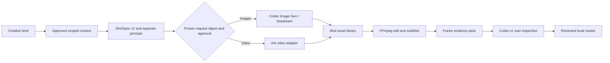

<p align="center">
  <a href="README_zh.md">简体中文</a>
</p>

<p align="center">
  
</p>

<h1 align="center">OpenDramaFlow</h1>

<p align="center">
  A Codex-native, local-first production harness for turning a creative brief into a structured commercial or narrative AI video workflow on Windows desktop.
</p>

<p align="center">
  
  
  
  
  
</p>

<p align="center">
  <a href="#quick-start">Quick Start</a> ·
  <a href="#workflow">Workflow</a> ·
  <a href="#interface">Interface</a> ·
  <a href="#capabilities">Capabilities</a> ·
  <a href="#codex-plugin">Codex Plugin</a> ·
  <a href="#development">Development</a> ·
  <a href="#security">Security</a>
</p>

---

## What is OpenDramaFlow?

OpenDramaFlow is not a single prompt wrapper or a one-shot video generator. It is a local production harness that gives Codex an inspectable project state and a controlled path through:

**brief → approved context → ShotSpec v2 → image assets → video shots → deterministic edit → evidence review → local master**

Scripts, structured shots, generation tasks, paid-call approvals, media paths, review evidence, and render jobs remain visible and recoverable. Codex drives the workflow through MCP; users are not required to create or connect canvas nodes by hand. The system does not inject sample stories, fake assets, placeholder shots, or simulated provider results into a blank project.

OpenDramaFlow targets **Codex Desktop on Windows PC**.

## Why use it?

| Need | What OpenDramaFlow provides |
| --- | --- |
| Repeatable production | Structured project, character, scene, shot, task, approval, and render state |
| Agent-native control | MCP tools that let Codex create, inspect, update, generate, and render projects |
| Automatic creative expertise | 44 specialist Skills plus one producer Skill, selected automatically from the request |
| Scoped production memory | Only explicitly approved series, volume/season, and creation memory enters a token-bounded context pack |
| Real cost boundaries | Explicit approval and hard image/video call caps before paid provider calls |
| Local credential safety | Windows DPAPI storage; plaintext API keys are never returned through MCP |
| Honest outputs | FFmpeg only assembles real generated or imported assets |
| Inspectable review | Deterministic evidence frames are extracted from the rendered bytes, then actually inspected by Codex or the user |
| Restartable work | Provider jobs, completed assets, and project state survive normal restarts |

## Workflow



1. Create a blank project.
2. Give Codex the genre, audience, duration, style, and delivery goal.
3. Codex reads a context pack containing only approved memory for the active series, volume/season, and creation page.
4. Codex writes the production plan and ordered ShotSpec v2 records. Static composition stays in `imagePrompt`; action and camera motion stay in `videoPrompt`.
5. OpenDramaFlow compiles and freezes the exact provider request digest, asset versions, and call caps before trusted human approval.
6. Codex Image Gen or Seedream creates image assets; the current Ark video adapter creates 4–15 second I2V shots from one approved first-frame reference.
7. FFmpeg assembles the real inputs. OpenDramaFlow then extracts deterministic evidence frames, which Codex or the user must actually inspect before recording a quality pass and final SHA-256 manifest.

## Interface

### Project library

The desktop interface starts with a truly empty project library and an onboarding guide that never writes demo content into project state.

Codex is the conversational control surface. The canvas reflects persisted briefs, assets, shots, jobs, and outputs; manual node creation or connection is not part of the required production path.


### Local credential vault

Users configure only the Volcengine Ark API key. Model IDs, aspect ratio, resolution, watermark behavior, and generation limits are maintained by the system instead of being exposed as routine form fields.


## Capabilities

### Creative production

- Premise, screenplay, character bible, scene, and shot authoring through Codex.
- Structured ShotSpec v2 plans with purpose, subjects, start/end state, camera, motion, sound intent, continuity, negative constraints, quality risks, and acceptance criteria.
- Separate static `imagePrompt` and motion-focused `videoPrompt`; an approved first frame carries identity and composition into I2V.
- Codex Image Gen task claiming and real asset attachment.
- Seedream 5.0 Pro image adapter.
- Ark asynchronous video task submission, polling, download, and shot attachment within the installed adapter's verified limits.
- Deterministic FFmpeg composition with normalized video, audio handling, and SRT subtitles.

### Automatic Skill routing

OpenDramaFlow includes 45 project Skills:

- 1 producer/orchestrator Skill.
- 44 Codex-native specialist Skills adapted for drama, ads, MV, explainers, prompting, video analysis, UI motion, and editing decisions.

`drama_route_skills` evaluates the user's original wording and loads up to three relevant specialist instructions. Users do not install, tick, or manually select a Skill for each request. When no specialist matches, the producer Skill is used automatically.

### Approval and recovery

- Paid Seedream and Seedance calls require an approved batch.
- Approval freezes the exact compiled request digests, plan revision, input asset versions, provider settings, and call caps; changing them requires new approval.
- Every batch has hard image and video call limits.
- Candidate memory is excluded until an exact version is explicitly reviewed and approved; later context packs are scoped to the active creation and its volume/season and series.
- Existing successful outputs are retained when a later provider step fails.
- Codex Image Gen jobs can pause the pipeline and resume after real images are attached.
- Render completion is followed by a hashed start/middle/end and shot-boundary frame pack. Extraction itself never marks the video as visually accepted.
- Project state and jobs are stored outside the repository by default.

## Quick Start

### Requirements

- Windows 10 or Windows 11
- Codex Desktop
- A Volcengine Ark API key for Seedream or Seedance calls

Node.js 20+, FFmpeg, the Codex plugin, and the zero-account HTTPS helper are checked and installed by the repository installer.

### Install by prompt (recommended)

Open Codex Desktop and send this single prompt. Codex performs the setup; the user does not need to type installation commands:

> Clone or open https://github.com/jiushiaaa/open-drama-flow on this Windows PC. Read the repository instructions, inspect `scripts/install.ps1`, then run it from the repository root. Verify that all 45 bundled Skills are present, the Codex plugin is enabled, and the local workbench health endpoint responds. Do not request or print any API key. When complete, tell me to restart Codex Desktop and then open OpenDramaFlow.

If you are using a fork, replace the URL in that prompt with your fork URL. All 45 built-in Skills, the installer, and the HTTPS bridge implementation are committed in the repository; they are not copied from the maintainer's computer.

### Direct installer (development fallback)

From an already cloned repository:

```powershell
.\scripts\install.ps1
```

The installer uses the official Cloudflare `cloudflared` Windows binary for a temporary [Quick Tunnel](https://developers.cloudflare.com/cloudflare-one/networks/connectors/cloudflare-tunnel/do-more-with-tunnels/trycloudflare/). It requires no Cloudflare account, API token, ngrok account, or public object-storage configuration. Quick Tunnels are intended for testing and development; a team-hosted HTTPS base URL can be supplied through `AI_DRAMA_ASSET_BRIDGE_BASE_URL` when a stable production endpoint is required.

### Run the desktop service

From the repository root:

```powershell
cd plugins\ai-drama-studio
npm install
npm start
```

Open [http://127.0.0.1:4317](http://127.0.0.1:4317).

The HTTP service binds to the loopback interface only. Project state is stored in `%LOCALAPPDATA%\OpenDramaFlow\data` by default. Set `AI_DRAMA_DATA_DIR` to override the location.

## Codex Plugin

The repository contains a Codex plugin manifest, MCP configuration, local marketplace entry, and all 45 Skills.

`scripts/install.ps1` registers the repository as a local marketplace, refreshes `ai-drama-studio@ai-drama-local`, and starts the workbench. Restart Codex Desktop after installation so the refreshed Skills and MCP server are loaded.

### MCP tools

| Tool | Purpose |
| --- | --- |
| `drama_get_state` | Read projects, shots, jobs, approvals, tasks, and recent events |
| `drama_get_context_pack` | Read token-bounded approved memory for the active production scope |
| `drama_review_memory` | Approve, supersede, or disable one exact candidate-memory version |
| `drama_route_skills` | Select and load specialist creative Skills automatically |
| `drama_list_skills` | List the available specialist Skill catalog |
| `drama_create_skill` | Write a new local Skill that immediately joins automatic routing |
| `drama_set_skill_enabled` | Enable or disable a Skill for automatic routing |
| `drama_create_project` | Create a blank local project without a model call |
| `drama_update_plan` | Write the formal story, characters, scenes, and shots |
| `drama_request_paid_batch` | Create a pending bounded approval for real provider calls |
| `drama_authorize_and_start_paid_batch` | Present the frozen scope for trusted human confirmation, then start exactly one batch |
| `drama_resume_paid_batch` | Resume an approved pipeline after image tasks are completed |
| `drama_claim_image_task` | Claim one queued Codex Image Gen task |
| `drama_complete_image_task` | Attach a real Codex-generated image to its shot |
| `drama_render_project` | Render available real media into a local MP4 with FFmpeg |
| `drama_prepare_quality_evidence` | Extract hashed inspection frames from the current rendered MP4 without auto-accepting it |
| `drama_record_quality_review` | Record checks only after Codex or the user inspects the actual output evidence |
| `drama_finalize_delivery` | Revalidate reviewed bytes and create the local SHA-256 delivery manifest |

## Project structure

```text
open-drama-flow/
├─ .agents/plugins/marketplace.json
├─ docs/images/
├─ scripts/install.ps1        # Windows one-step installer
├─ plugins/ai-drama-studio/
│  ├─ .codex-plugin/plugin.json
│  ├─ public/                 # Windows desktop web interface
│  ├─ scripts/                # DPAPI credential helper
│  ├─ skills/                 # Producer + specialist Skills
│  ├─ src/                    # HTTP, MCP, providers, state, workflow, FFmpeg
│  └─ test/
├─ README.md
├─ README_zh.md
└─ LICENSE
```

## Development

```powershell
cd plugins\ai-drama-studio
npm run check
npm test
```

The regression suite checks blank-project integrity, all 45 shipped Skill entrypoints, Skill import and persistent toggles, automatic routing, producer fallback, and deterministic media rendering.

## Security

- Never commit API keys, provider tokens, private media, or runtime project data.
- The Ark API key is encrypted for the current Windows user with DPAPI and is never returned by MCP.
- `studio-data`, local audits, dependencies, generated QA output, and credential files are excluded from Git.
- Provider calls are not evidence of success until a real result is downloaded and attached to the project.
- A generated evidence pack is not a visual pass; the returned frames must be opened and inspected, and motion/audio/subtitles require applicable full-video checks.
- Seedance still requires an HTTPS or `asset://` reference. OpenDramaFlow automatically exposes the exact local image through a random-token, one-hour HTTPS route using Cloudflare Quick Tunnels; the project never uploads the whole asset library. If the network blocks Quick Tunnels, the job waits safely and can use `AI_DRAMA_ASSET_BRIDGE_BASE_URL` or an Ark `asset://` reference instead.

## Current boundaries

- A real paid end-to-end production should be validated with your own provider entitlement before production use.
- The current Ark video adapter supports one first-frame image-to-video reference (`https://` or trusted `asset://`) and integer durations from 4 to 15 seconds. It does not expose multi-reference, reference-video/audio, first-and-last-frame continuation, or in-place video editing.
- Provider-native audio can be requested only when enabled and declared by the shot contract. Audio is considered present and usable only when the downloaded output contains an audio stream and the actual result passes the required listening/review evidence; model marketing or a request flag is not proof.
- Voice cloning, professional NLE project export, and controllable 3D scenes remain planning-only until real adapters are connected.
- OpenDramaFlow is designed for the Windows PC desktop workflow.

## License

[MIT](LICENSE)
