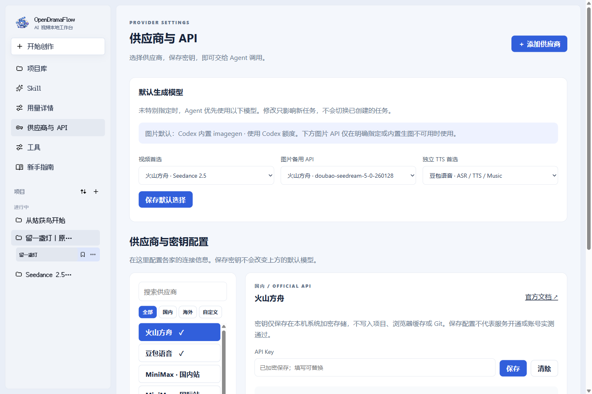
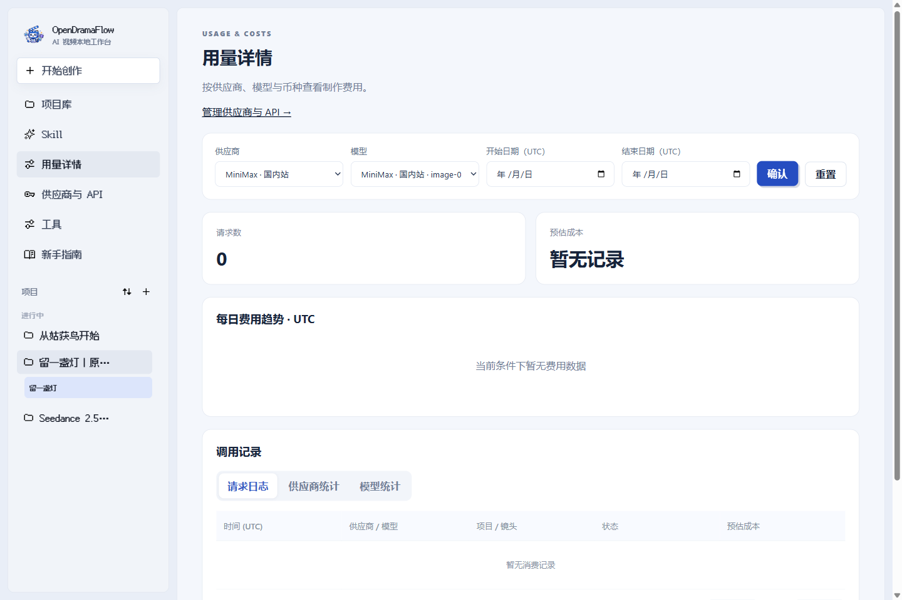
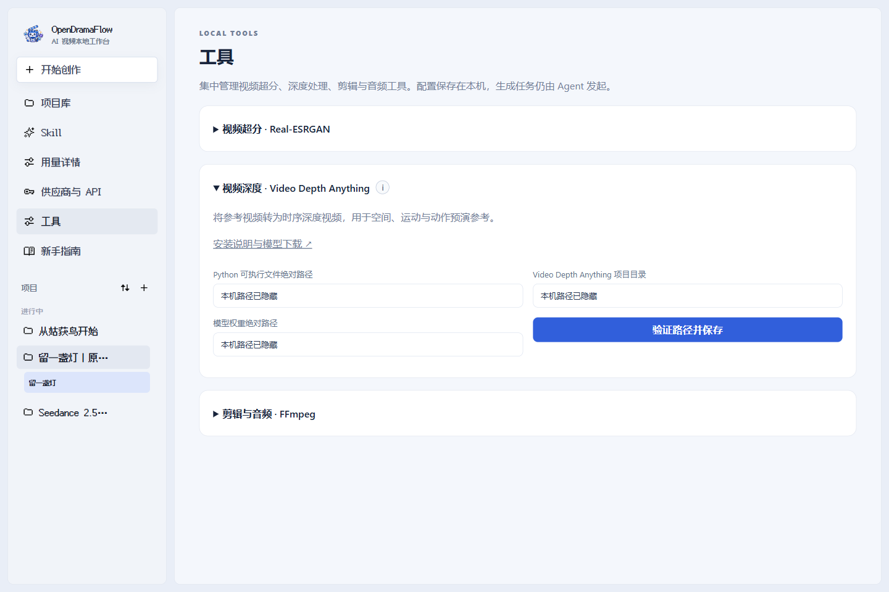
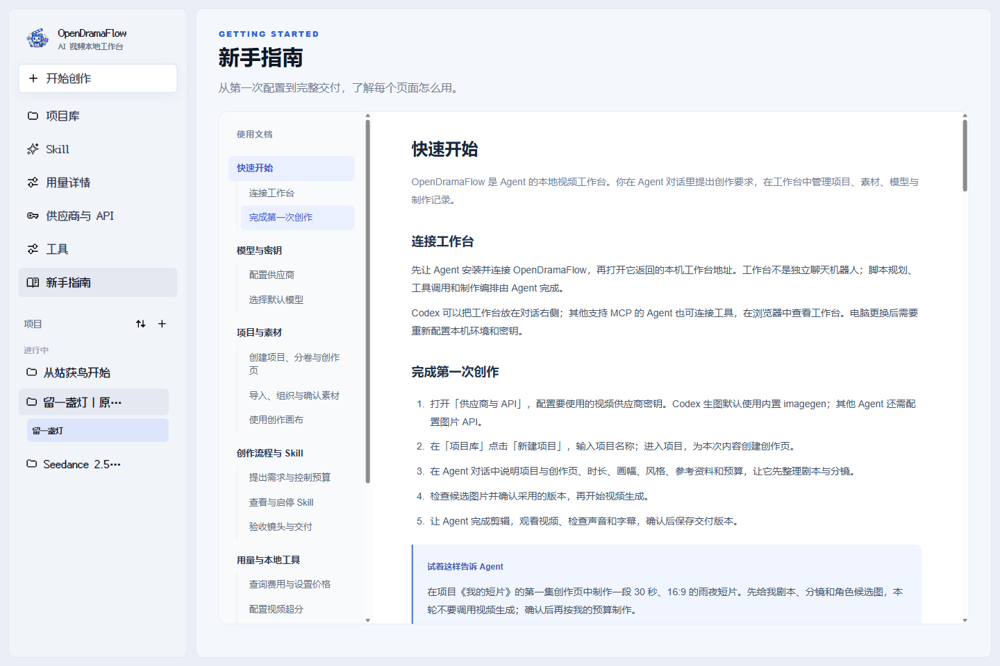
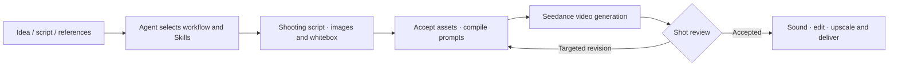

<p align="center">English · <a href="README_zh.md">简体中文</a></p>

<p align="center">
  
</p>

<h1 align="center">OpenDramaFlow</h1>

<p align="center"><strong>Your story. An Agent in the director's chair.</strong><br />A local-first video production harness, with a native Codex plugin and a standard MCP entry point.</p>

<p align="center">
  
  
  
  
</p>

<p align="center"><a href="#showcase">Showcase</a> · <a href="#quick-start">Quick start</a> · <a href="#agent-compatibility">Agent compatibility</a> · <a href="#production-workflow">Workflows</a> · <a href="#built-in-skills">Skills</a> · <a href="AGENT_GUIDE.md">Agent guide</a></p>

OpenDramaFlow turns your AI assistant into a video-production workspace: plan a story, design characters and shots, generate media, review results and assemble a finished video. It connects **47 Skills, five production workflows, model APIs, versioned assets and local postproduction** through MCP.

Built for **Windows and macOS**, with a native Codex plugin and standard local MCP integration for other Agents. The Agent directs the work—you do not have to wire a graph yourself. **Codex uses its built-in image generator; other Agents use your configured image API key.**

**Create in the Codex conversation on the left; inspect assets and results in the plugin canvas on the right.** No manual node building or workflow wiring required.

## Why OpenDramaFlow

- **Conversation-led production.** Adapt a novel, make a short film or plan a product ad. The Agent selects specialist Skills, writes shots and prompts, and calls the tools.
- **A visible production workspace.** Organize projects, volumes/seasons, creation pages and asset folders. Preview full images, play videos and follow relationships on an infinite canvas.
- **Built around Seedance.** Give image, video, audio and first/last-frame references distinct roles across generation, extension and editing.
- **Revise and resume.** Version-bound stage checkpoints and provider task IDs help recover interrupted work. Record alternatives, decisions and cost impact; repair affected shots while preserving accepted work.
- **Project-scoped memory.** Keep experimental lessons separate from approved facts so one experiment cannot silently rewrite a character or another project.
- **A clear control panel.** Choose default models, manage provider keys, inspect usage and configure local tools in separate pages. A chapter-linked beginner guide walks you through the first production.


<details>
<summary>Project library and Skill browser</summary>


</details>

### Inside the workbench

| Page | What you can do |
| --- | --- |
| Project library | Organize projects, volumes and creation pages; collapse each level and sort creation pages by name or creation order |
| Skill | Search and enable Skills; explore independently collapsible folders and instruction files |
| Usage Details | Filter by provider, its models and UTC date range; view request counts, estimated costs and daily trends; edit model prices below the logs |
| Providers & API | Set default video/image/TTS models separately from provider credentials and compatible custom endpoints |
| Tools | Configure local Real-ESRGAN, save Video Depth Anything environment paths, and check FFmpeg dependencies |
| Beginner guide | Follow setup, assets, production, costs and troubleshooting instructions with a two-level table of contents and shareable chapter links |

Projects and Skills load independently. A compact, revision-aware read model keeps large production histories off the page-loading path; usage reads run in a separate worker and reuse unchanged state.

<details>
<summary>Providers, usage, local tools and the beginner guide</summary>

**Default models and credentials are separate.** Saving a key does not change your preferred model or retarget existing jobs.



**Provider-scoped usage.** This view selects a model with no consumption records.



**Local tools in one place.** Machine-specific paths are hidden in this screenshot. Upscale rows are processing tasks, not billing records; depth-path configuration does not run inference.



**A guide you can navigate.** Select a section or subsection without leaving the guide.



</details>

## Showcase

### 《从姑获鸟开始》城寨风云篇 · Episode 1

**[Watch on Douyin](https://v.douyin.com/rD_OP4_kMSI/)** · **[Watch on bilibili](https://www.bilibili.com/video/BV1WtYC6UEEN/?vd_source=e0643483c6a3517007cd0589b285add0#reply117268142886086)**

[](https://v.douyin.com/rD_OP4_kMSI/)

A complete production case spanning character and scene design, generated shots, sound, editing and packaging.


### Before and after upscaling

**720p source on the left; local 4K upscale on the right.** Both panels show the same region of the same shot, synchronized.


[Original-resolution samples and processing details](production/publish-examples/README.md)

## Quick start

### Give this link to your Agent

```text
Install https://github.com/jiushiaaa/open-drama-flow for my current Agent.
Read README.md, AGENT_GUIDE.md and AGENTS.md first. Detect the host and use
the appropriate installation route. Preserve existing MCP settings and running
projects. Verify the connection without paid model calls, then open the workbench.
```

An Agent with local terminal and file access can follow the guide. If you paste only the repository URL, tell it that you want to **install**, rather than review, the project.

### Prerequisites

- **Windows or macOS**, and **Git**.
- **Node.js 20+ / npm** and **FFmpeg / ffprobe** available to the Agent.
- **Codex Desktop**, or another local Agent with **stdio MCP** and local file access.
- Your own provider credentials for cloud generation. Default: **Ark / Seedance**; **Doubao Speech** is optional. Provider charges apply.

Python is not required for the core plugin. Optional depth-model tooling has separate dependencies; local upscaling needs its own runtime, weights and compatible hardware.

### Install for Codex

Windows:

```powershell
git clone https://github.com/jiushiaaa/open-drama-flow.git
cd open-drama-flow
powershell -ExecutionPolicy Bypass -File .\scripts\install.ps1
```

macOS, after cloning and entering the same repository:

```bash
bash scripts/install.sh codex
```

Installers check dependencies and use available system package managers for missing tools. The macOS installer needs Homebrew for automatic dependency setup. After installation, reload the plugin or open a new Codex task. No separate image API key is needed when using Codex's built-in image tool.

### Connect another local Agent

Clone the repository as above, then run from its root:

```powershell
npm --prefix plugins/ai-drama-studio ci
node scripts/agent-setup.mjs --check
node scripts/agent-setup.mjs --print-config
```

Merge the printed `ai-drama-studio` server entry into your host's MCP settings without replacing other servers. It uses absolute paths and does not require Codex. [Host-specific instructions and connection checks →](AGENT_GUIDE.md)

On macOS, `bash scripts/install.sh generic` handles dependency setup, isolated verification and config output together. The generated configuration selects the generic host profile; keep its `env` fields when merging it.

**Configure your keys:** open **Providers & API (供应商与 API)**, select a preset, and enter its credentials. Endpoints and supported models are prefilled. Ark/Seedance and optional Doubao Speech remain defaults; outside Codex, configure an image API too. Compatible custom media endpoints are supported. Credentials use Windows DPAPI or macOS Keychain, never tracked repository files. Open the URL returned by `drama_get_state` (default Codex port 4317, generic port 4319).

### Make your first video

Describe a bounded first project:

> Use OpenDramaFlow to turn my story into a 15-second, 16:9 suspense short. Plan the events, characters and shots first. Use the image route for my current Agent and import candidates only after I accept them. Make one video sample before continuing, and explain the expected model-call count first.

Automatic execution stays within the current objective and defined call limits; image admission and production memory retain their acceptance boundaries. Manual approval is available per project. Neither mode requires building canvas nodes by hand.

## Agent compatibility

The portable interface is **MCP + readable production instructions**, not a universal proprietary plugin package.

| Agent | Connection on Windows / macOS | Image generation |
| --- | --- | --- |
| Codex Desktop | Native plugin or Codex MCP profile | Built-in imagegen by default |
| Cursor / Claude Code | Standard local stdio MCP | Configured image API key |
| Trae Worker / WorkBuddy / DeepSeekHarness / other Agents | Their local stdio MCP interface, where available | Configured image API key |

Your Agent needs local process/file access and MCP tool calling; a proprietary plugin marketplace alone is not sufficient. The same project state, Skills, canvas and acceptance rules are shared across hosts. [Installation and capability checklist →](AGENT_GUIDE.md#1-check-the-host-before-installing)

<details>
<summary>Platform and host verification status</summary>

Windows integration and standard MCP smoke tests have been run locally. macOS installation, Application Support paths and Keychain storage are implemented, with native tests in the Windows/macOS CI workflow; macOS end-to-end production has not yet been run by this project maintainer. Other Agent applications still need host-level connection and media-review checks. We do not provide a hosted MCP gateway or Linux credential backend. Unsupported media inspection or trusted confirmation must not be represented as completed review.

</details>

## Production workflow

Choose a production type, not a blank node graph:

| Type | Production path | Example request |
| --- | --- | --- |
| Drama / short film | Source → masters → shooting plan → previz → generation → continuity → delivery | “Adapt this authorized scene into a suspense short.” |
| Advertising | Product → concept → references → shooting → generation → compliance → delivery | “Make a 15-second product ad using my approved pack shots.” |
| Explainer | Outline → script → visual mapping → assets → edit → review → delivery | “Explain this topic in 60 seconds using my supplied facts.” |
| Music video | Music → concept → beats → assets → edit → review → delivery | “Cut a visual sequence to this licensed music track.” |
| Motion demo | Interface → hierarchy → timeline → local animation → optional generation → review → delivery | “Turn these UI screens into a concise product demo.” |

Each stage defines inputs, required artifacts, available tools, acceptance criteria and a recovery location. These are Agent-readable contracts—not a promise that every stage can run without the necessary model, renderer or review tools.



1. **Direct before generating.** Codex turns source material and approved settings into a shooting script: events, dialogue, camera, action and continuity. Where useful, it writes a 3D whitebox for spatial and camera previsualization.
2. **Assign each reference a job.** Codex uses built-in imagegen; other Agents use a configured image API. Accepted images enter the library; prompts and appearance, motion, camera and sound references go to Seedance 2.5. Current standalone image API adapters are text-only, not reference-image or image-editing adapters.
3. **Repair locally and deliver.** Review motion, identity, dialogue and subtitles, preserve accepted content, then organize sound, editing, optional upscaling and delivery. Lessons become candidates before approval into production memory.

### Agent-first, with durable safeguards

| Layer | What it contains | What the Agent learns |
| --- | --- | --- |
| Capabilities | MCP tools, capability catalog, production definitions | What exists and is runnable now |
| Production | Producer contracts, stage standards, specialist Skills | How to make and accept the work |
| Technical knowledge | Model interfaces, FFmpeg and Real-ESRGAN references | How to use the selected technology |

The Agent chooses the creative approach; Node.js enforces budgets, versions, state transitions and parameter checks. Checkpoints record evidence and recovery; decisions record alternatives, selection/rejection reasons and cost impact. Neither record replaces image acceptance or approved production memory. There is no mandatory web-research phase or added approval popup at every stage. [Stage contracts and decision records →](plugins/ai-drama-studio/docs/production-contracts.md)

<details>
<summary>Whitebox space and camera previsualization</summary>


[Whitebox video and editable source](production/publish-examples/whitebox-camera/README.md) · [Production guide and tool setup](docs/production-guide.md)

</details>

## Built-in Skills

**47 built-in Skills: one producer and 46 specialists.** The MCP router selects relevant instructions; native Codex integration also exposes Skills directly. Other hosts can read those same Markdown files without a native Skill installer. Representative workflows:

| Skill | Responsibility | Good for |
| --- | --- | --- |
| [AI drama producer](plugins/ai-drama-studio/skills/ai-drama-producer/SKILL.md) | Planning, routing, production state and delivery | End-to-end orchestration |
| [Novel preproduction](plugins/ai-drama-studio/skills/novel-comic-drama-preproduction/SKILL.md) | Source organization, scripts, assets and director's storyboards | Long-form and volume-based adaptations |
| [Character and scene storyboards](plugins/ai-drama-studio/skills/character-scene-storyboard/SKILL.md) | Align character references, settings and story beats | Preproduction and shot planning |
| [Film shots and character cards](plugins/ai-drama-studio/skills/film-shot/SKILL.md) | Framing, camera position, lighting and blocking | Cinematic shots and identity consistency |
| [Seedance prompt expert](plugins/ai-drama-studio/skills/seedance-prompt-expert/SKILL.md) | Multimodal, first/last-frame, extension and editing prompts | Reference roles, sound and continuity constraints |
| [Brand ads](plugins/ai-drama-studio/skills/brand-ad/SKILL.md) | Materials, craftsmanship, logos and product heroes | Lightweight ads up to 15 seconds |
| [Anime and game PVs](plugins/ai-drama-studio/skills/anime-game-pv/SKILL.md) | Character, ensemble and world introductions | Game and event promos up to 15 seconds |
| [Cinematic titles and teasers](plugins/ai-drama-studio/skills/cinematic-title-sequence/SKILL.md) | Titles, cast, character action and suspense | Opening sequences and concept teasers |
| [Editing craft](plugins/ai-drama-studio/skills/clip-studio-craft/SKILL.md) | Rhythm, cuts, transitions, captions and speed | Refining an existing timeline |
| [Video deconstruction](plugins/ai-drama-studio/skills/video-deconstruct/SKILL.md) | Extract shot evidence and structure from references | Shot-by-shot analysis and prompt reconstruction |
| [Creator method transfer](plugins/ai-drama-studio/skills/creator-method-transfer/SKILL.md) | Turn tutorials and references into testable shot hypotheses | Motion, acting and camera experiments |

Skills provide professional workflows, not additional model capabilities. [Browse all Skills](plugins/ai-drama-studio/skills)

**The current video-generation Skills are tuned for Seedance 2.5.** General planning and editing knowledge can be reused, but prompts, reference roles and generation procedures have not been specifically adapted or quality-validated for other models. Switching providers does not translate a Skill automatically; results may differ.

<details>
<summary>Ask your Agent to adapt a Skill for another model</summary>

Ask your Agent to make a model-specific variant in your local checkout:

> Adapt this Skill for my selected provider and model. Read its current official documentation and the plugin's actual adapter capabilities first. Adjust prompts, reference roles, duration, sound and review criteria; explicitly identify unsupported features. Preserve the Seedance default, accepted assets and existing budget/acceptance rules. Validate the files and propose one bounded sample before claiming the adaptation works.

A Skill update cannot add a missing API adapter. Changes to instructions and account-level generation tests are separate steps.

</details>

## Models and extensions

### Generation providers

Choose among 11 regional/service presets and 22 capability profiles in **Providers & API**. These are specific integrations, **not every model or mode offered by each vendor**. New adapters have simulated interface tests, **not live-account verification**; saving a key does not establish entitlement, balance or successful generation. See [supported inputs, official sources and pricing boundaries](docs/provider-settings.md).

| Provider / entry point | Models and supported use | Boundary |
| --- | --- | --- |
| Codex built-in image-gen | Characters, scenes and reference images | Default image entry point supplied by the current Codex task; import after acceptance |
| Volcengine Ark | Seedance 2.5 video; Seedream text-to-image | Seedream is the default API image route outside Codex; Seedance inputs and modes remain subject to the selected model/API constraints |
| Doubao Speech | ASR, standard TTS and SeedAudio 1.0 music | Separate optional speech configuration and service entitlement; without it, use Seedance's native video sound |
| MiniMax · China / international | image-01; Hailuo 2.3; speech-2.8-hd TTS | Separate endpoints, keys and currencies; text inputs; 6-second 768P video |
| Alibaba Cloud · Beijing | Wanx 2.1 turbo images; Wan 2.7 video | Text inputs; 5-second 720P video |
| Tencent Cloud | Hunyuan TextToImageLite; Hunyuan video | SecretId + SecretKey signing; text inputs; 720P video |
| Kling · international API | Kling v3 images; Kling 3.0 video | API Key authentication; text inputs; 5-second 720P silent video |
| Zhipu | GLM-Image; CogVideoX-3 | Text inputs; quality video with native audio |
| Runway | Gen-4 Image; Gen-4.5 video | Text inputs; 720P; 5-second video |
| fal | Wan 2.2 A14B text-to-video; FLUX Schnell text-to-image | Experimental; text-only inputs in these adapters, not Seedance-equivalent reference/editing support |
| Replicate | FLUX Schnell text-to-image | Experimental; no Replicate video adapter currently included |

In Codex, API image models are fallbacks used only on explicit request or verified built-in-tool failure/unavailability. In other Agents, configured image APIs are the normal route. Both paths stage candidates outside the library and preserve acceptance and frozen call limits. Default selection changes do not retarget existing jobs. Standalone TTS selection does not change Doubao ASR/music. Custom providers must implement one of the supported media protocols, not merely a chat-compatible API.

### Local tools and optional extensions

| Tool | Purpose | Integration |
| --- | --- | --- |
| FFmpeg | Editing, mixing, captions, inspection and export | Tools page detects FFmpeg / ffprobe and required filters; per-task processing parameters are supplied by the Agent |
| [Real-ESRGAN](https://github.com/xinntao/Real-ESRGAN) | Resumable local MCP upscaling | Configure runtime/weights, GPU and tile size in Tools; inspect task progress and pause/resume; verified chunks and preserved audio |
| [Video Depth Anything](https://github.com/DepthAnything/Video-Depth-Anything) | Temporally consistent video depth references | Tools saves Python, repository and checkpoint paths for Agent-operated external processing; path validation is not installation or inference verification |

**Upscaling is local only.** OpenDramaFlow does not provide hosted Real-ESRGAN, cloud upscaling or a shared GPU server.

Choose your Codex model; the plugin does not require a hard-coded version. SeedAudio 1.0 music uses the optional Doubao Speech configuration; ChatCut remains an external editing extension. [Configuration and capability boundaries](docs/production-guide.md#models-and-tools)

<details>
<summary>Why Video Depth Anything?</summary>

**Give action design a spatial reference, not just a verbal description.** During episode-one production, prompts and hand-built whiteboxes struggled to convey convincing fight distances, approaches, retreats and occlusion. We therefore explore temporal depth from authorized action references to help Codex analyze and plan movement.

[Video Depth Anything](https://github.com/DepthAnything/Video-Depth-Anything) estimates depth across video frames, representing near/far relationships instead of the original colors and textures, with an emphasis on temporal consistency. In this project, it serves three purposes:

- **Inspect spatial relationships.** Compare source and depth video to study relative positions, approaching or receding subjects, occlusion and camera movement.
- **Translate references into shot design.** Codex analyzes both views to describe action phases and blocking in shooting scripts, whitebox previz and Seedance prompts—without automatically copying the source's characters, costumes or setting.
- **Run comparative generation experiments.** Where the API permits and inputs are approved, try depth-visualization video as a video reference. Compare results with and without it, recording the asset versions actually submitted.

This is an **optional action-reference experiment**, not a prerequisite for ordinary production. Depth is not a skeleton, joint trajectory or contact force, and this is not a dedicated Seedance depth-control interface. Codex analyzing a reference does not train a model. Reliable gains for complex fights or precise motion transfer have not yet been established.

</details>

## Known limitations

- **Complex fights still need iteration.** Grips, fast exchanges, occlusion and weight shifts can fail. Whiteboxes and temporal depth do not replace skeletal motion capture or contact solving.
- **References are not hard constraints.** Multimodal generation and editing can alter identity or protected content. Longer productions still require cross-shot review and normal-speed viewing and listening.
- **Asset retrieval is metadata-based.** Search uses shot associations, versions and asset metadata—not semantic video understanding. It helps locate assets but does not replace viewing and listening during review.
- **Generation and local compute have costs.** Availability depends on account access, provider APIs and input conditions. Upscalers, depth models and optional plugins need separate setup.

## Docs and development

- [Agent installation, host compatibility and zero-cost verification](AGENT_GUIDE.md)
- [Production guide: models, acceptance and local data](docs/production-guide.md)
- [Stage contracts, recovery and decision records](plugins/ai-drama-studio/docs/production-contracts.md)
- [Tool capabilities, local audio finishing and cost records](plugins/ai-drama-studio/docs/toolchain.md)
- [Workbench settings, usage filters and local tools](docs/provider-settings.md) — provider credentials, estimated costs and local processing have separate pages; the UI no longer includes account-bill synchronization settings.
- [Plugin and MCP documentation](plugins/ai-drama-studio/README.md)
- [Public examples and reproducible assets](production/publish-examples/README.md)
- [Model and reference sources](docs/reference-sources.md)
- [Canvas components and build](plugins/ai-drama-studio/ui/README.md)
- [Contribution and working agreement](AGENTS.md)
- [Production lessons: identity, causal action and shot handoffs](docs/production-iteration-20260919.md)

Reproducible issues, workflow improvements and specialist Skills are welcome. Development checks make no paid model calls:

```powershell
node --test scripts/agent-setup.test.mjs
cd plugins/ai-drama-studio
npm ci
npm run check
npm test
node scripts/sync-skill-manifest.mjs --check
node scripts/verify-skill-mcp.mjs
```

Software is [MIT licensed](LICENSE). The canvas uses React + TypeScript components from [infinite-canvas](https://github.com/basketikun/infinite-canvas), with upstream licensing and attribution retained. Third-party models, weights and creative assets retain their own licenses.
