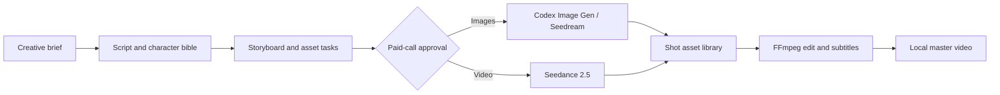

<p align="center">
  <a href="README_zh.md">简体中文</a>
</p>

<p align="center">
  
</p>

<h1 align="center">OpenDramaFlow</h1>

<p align="center">
  A Codex-native, local-first production harness for turning a creative brief into a structured AI comic-drama workflow on Windows desktop.
</p>

<p align="center">
  
  
  
  
  
</p>

<p align="center">
  <a href="#quick-start">Quick Start</a> ·
  <a href="#workflow">Workflow</a> ·
  <a href="#interface">Interface</a> ·
  <a href="#capabilities">Capabilities</a> ·
  <a href="#codex-plugin">Codex Plugin</a> ·
  <a href="#development">Development</a> ·
  <a href="#security">Security</a>
</p>

---

## What is OpenDramaFlow?

OpenDramaFlow is not a single prompt wrapper or a one-shot video generator. It is a local production harness that gives Codex an inspectable project state and a controlled path through:

**brief → script → character bible → storyboard → image assets → video shots → edit → local master**

Scripts, shots, generation tasks, paid-call approvals, media paths, and render jobs remain visible and recoverable. The system does not inject sample stories, fake assets, placeholder shots, or simulated provider results into a blank project.

OpenDramaFlow targets **Codex Desktop on Windows PC**.

## Why use it?

| Need | What OpenDramaFlow provides |
| --- | --- |
| Repeatable production | Structured project, character, scene, shot, task, approval, and render state |
| Agent-native control | MCP tools that let Codex create, inspect, update, generate, and render projects |
| Automatic creative expertise | 48 specialist Skills plus one producer Skill, selected automatically from the request |
| Real cost boundaries | Explicit approval and hard image/video call caps before paid provider calls |
| Local credential safety | Windows DPAPI storage; plaintext API keys are never returned through MCP |
| Honest outputs | FFmpeg only assembles real generated or imported assets |
| Restartable work | Provider jobs, completed assets, and project state survive normal restarts |

## Workflow



1. Create a blank project.
2. Give Codex the genre, audience, duration, style, and delivery goal.
3. Codex writes the production plan, character bible, scenes, and ordered shots.
4. OpenDramaFlow creates image tasks and a bounded paid-call approval.
5. Codex Image Gen or Seedream creates image assets.
6. Seedance 2.5 generates video shots from approved, reachable visual references.
7. FFmpeg normalizes real clips, assembles the timeline, and burns timed subtitles.

## Interface

### Project library

The desktop interface starts with a truly empty project library and an onboarding guide that never writes demo content into project state.


### Local credential vault

Users configure only the Volcengine Ark API key. Model IDs, aspect ratio, resolution, watermark behavior, and generation limits are maintained by the system instead of being exposed as routine form fields.


## Capabilities

### Creative production

- Premise, screenplay, character bible, scene, and shot authoring through Codex.
- Ordered shot plans with duration, framing, prompt, subtitle, and status.
- Codex Image Gen task claiming and real asset attachment.
- Seedream 5.0 Pro image adapter.
- Seedance 2.5 asynchronous task submission, polling, download, and shot attachment.
- Deterministic FFmpeg composition with normalized video, audio handling, and SRT subtitles.

### Automatic Skill routing

OpenDramaFlow includes 49 project Skills:

- 1 producer/orchestrator Skill.
- 48 Codex-native specialist Skills adapted for drama, ads, MV, explainers, prompting, video analysis, dubbing planning, UI motion, and editing decisions.

`drama_route_skills` evaluates the user's original wording and loads up to three relevant specialist instructions. Users do not install, tick, or manually select a Skill for each request. When no specialist matches, the producer Skill is used automatically.

### Approval and recovery

- Paid Seedream and Seedance calls require an approved batch.
- Every batch has hard image and video call limits.
- Existing successful outputs are retained when a later provider step fails.
- Codex Image Gen jobs can pause the pipeline and resume after real images are attached.
- Project state and jobs are stored outside the repository by default.

## Quick Start

### Requirements

- Windows 10 or Windows 11
- Codex Desktop
- Node.js 20 or newer
- FFmpeg available on `PATH`
- A Volcengine Ark API key for Seedream or Seedance calls

### Run the desktop service

From the repository root:

```powershell
cd plugins\ai-drama-studio
npm install
npm start
```

Open [http://127.0.0.1:4317](http://127.0.0.1:4317).

The HTTP service binds to the loopback interface only. Project state is stored in `%LOCALAPPDATA%\OpenDramaFlow\data` by default. Set `AI_DRAMA_DATA_DIR` to override the location.

## Codex Plugin

The repository contains a Codex plugin manifest, MCP configuration, local marketplace entry, and all 49 Skills.

From the repository root:

```powershell
codex plugin marketplace add .
codex plugin add ai-drama-studio@ai-drama-local
```

After updating the plugin, run the second command again and start a new Codex task so the refreshed Skills and MCP server are loaded.

### MCP tools

| Tool | Purpose |
| --- | --- |
| `drama_get_state` | Read projects, shots, jobs, approvals, tasks, and recent events |
| `drama_route_skills` | Select and load specialist creative Skills automatically |
| `drama_list_skills` | List the available specialist Skill catalog |
| `drama_create_project` | Create a blank local project without a model call |
| `drama_update_plan` | Write the formal story, characters, scenes, and shots |
| `drama_request_paid_batch` | Create a pending bounded approval for real provider calls |
| `drama_resume_paid_batch` | Resume an approved pipeline after image tasks are completed |
| `drama_claim_image_task` | Claim one queued Codex Image Gen task |
| `drama_complete_image_task` | Attach a real Codex-generated image to its shot |
| `drama_render_project` | Render available real media into a local MP4 with FFmpeg |

## Project structure

```text
open-drama-flow/
├─ .agents/plugins/marketplace.json
├─ docs/images/
├─ plugins/ai-drama-studio/
│  ├─ .codex-plugin/plugin.json
│  ├─ public/                 # Windows desktop web interface
│  ├─ scripts/                # DPAPI credential helper
│  ├─ skills/                 # Producer + specialist Skills
│  ├─ src/                    # HTTP, MCP, providers, state, workflow, FFmpeg
│  └─ test/
├─ README.md
├─ README_zh.md
└─ LICENSE
```

## Development

```powershell
cd plugins\ai-drama-studio
npm run check
npm test
```

The current regression suite checks blank-project integrity, all 48 specialist entrypoints, automatic routing for representative creative requests, and producer fallback.

## Security

- Never commit API keys, provider tokens, private media, or runtime project data.
- The Ark API key is encrypted for the current Windows user with DPAPI and is never returned by MCP.
- `studio-data`, local audits, dependencies, generated QA output, and credential files are excluded from Git.
- Provider calls are not evidence of success until a real result is downloaded and attached to the project.
- Codex Image Gen files need a reachable URL, a Volcengine Asset ID, or an object-storage bridge before Seedance can consume them.

## Current boundaries

- A real paid end-to-end production should be validated with your own provider entitlement before production use.
- Voice cloning, professional NLE project export, and controllable 3D scenes remain planning-only until real adapters are connected.
- OpenDramaFlow is designed for the Windows PC desktop workflow.

## License

[MIT](LICENSE)
