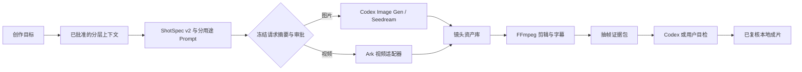
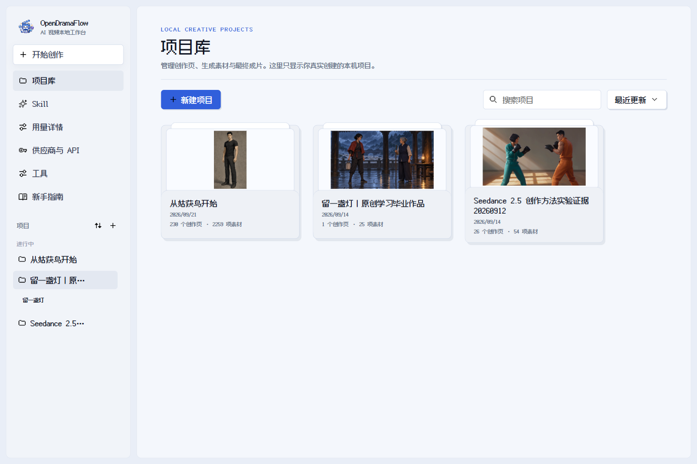
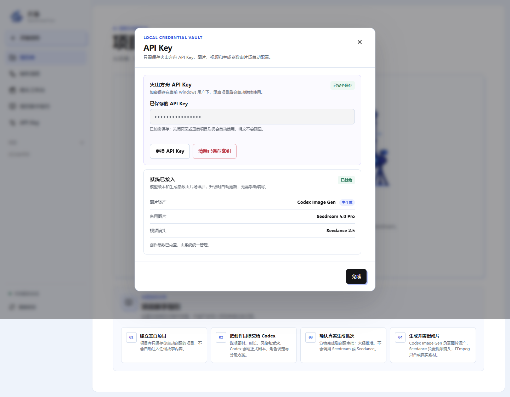

<p align="center">
  <a href="README.md">English</a>
</p>

<p align="center">
  
</p>

<h1 align="center">OpenDramaFlow</h1>

<p align="center">
  面向 Codex PC 桌面版的开源本地 AI 视频生产框架：从商业或叙事目标、结构化镜头和模型审批，到素材、剪辑、复核与成片。
</p>

<p align="center">
  
  
  
  
  
</p>

<p align="center">
  <a href="#快速开始">快速开始</a> ·
  <a href="#生产流程">生产流程</a> ·
  <a href="#界面展示">界面展示</a> ·
  <a href="#核心能力">核心能力</a> ·
  <a href="#codex-插件">Codex 插件</a> ·
  <a href="#开发与验证">开发与验证</a> ·
  <a href="#安全边界">安全边界</a>
</p>

---

## OpenDramaFlow 是什么？

OpenDramaFlow 不是一个简单的 Prompt 包装器，也不是只能点击一次的视频生成页面。它是一套让 Codex 可以持续操作的本地制作 harness，为整条 AI 漫剧生产链提供可检查、可恢复的项目状态：

**创作目标 → 已批准上下文 → ShotSpec v2 → 图片资产 → 视频镜头 → 确定性剪辑 → 证据复核 → 本地成片**

剧本、结构化镜头、生成任务、付费审批、素材路径、复核证据和渲染任务都处于同一个工作流中。Codex 通过 MCP 推动整条链路，用户不需要手工新建或连接画布节点。空白项目不会自动注入示例故事、假素材、占位分镜或模拟模型结果。

OpenDramaFlow 专为 **Windows PC 上的 Codex Desktop** 设计。

## 为什么值得用？

| 需求 | OpenDramaFlow 提供的能力 |
| --- | --- |
| 稳定复用制作流程 | 结构化管理项目、人物、场景、分镜、任务、审批和成片 |
| Codex 全程操作 | 通过 MCP 创建、读取、修改、生成和渲染项目 |
| 自动选择专业能力 | 44 个专业 Skill 加 1 个总控 Skill，按用户需求自动加载 |
| 分层生产记忆 | 只有明确批准的系列、分卷/季度和创作页记忆才会进入限额 context pack |
| 控制真实费用 | 付费调用前必须审批，并设置图片和视频硬性次数上限 |
| 本地保护密钥 | 使用 Windows DPAPI 加密，MCP 永远不会返回 API Key 明文 |
| 拒绝伪造产物 | FFmpeg 只合成真实生成或导入的图片与视频 |
| 可检查质量复核 | 从当前成片确定性抽取证据帧，再由 Codex 或用户实际目检 |
| 支持中断恢复 | 项目状态、已完成素材和供应商任务可以在重启后继续使用 |

## 生产流程



1. 创建一个真正的空白项目。
2. 向 Codex 说明题材、受众、时长、风格和交付目标。
3. Codex 读取只含当前系列、分卷/季度与创作页已批准记忆的 context pack。
4. Codex 写入正式计划和有序 ShotSpec v2；`imagePrompt` 只负责静态构图，`videoPrompt` 负责动作与运镜。
5. OpenDramaFlow 在可信人工审批前编译并冻结准确的供应商请求摘要、素材版本与调用上限。
6. Codex Image Gen 或 Seedream 生成真实图片；当前 Ark 视频适配器只用一张已批准首帧生成 4–15 秒 I2V 镜头。
7. FFmpeg 组织真实素材，随后系统确定性抽取证据帧；Codex 或用户必须实际查看后才能记录质量通过并生成最终 SHA-256 清单。

## 界面展示

### 项目库

桌面端从真正的空项目库开始。页面中的新手指引只是静态文档，不会向项目状态写入演示内容。

Codex 是对话控制面。画布负责呈现已经持久化的 brief、素材、镜头、任务和成片；生产链不要求用户手工创建或连接节点。



### 本地密钥仓

普通用户只需要配置火山方舟 API Key。模型 ID、画幅、分辨率、水印和生成上限由系统维护，不作为日常表单暴露。



## 核心能力

### 创作与生成

- 由 Codex 编写故事梗概、正式剧本、角色设定、场景和分镜。
- ShotSpec v2 结构化记录镜头目的、主体、起止状态、机位、运动、声音意图、连续性、负面约束、质量风险和验收标准。
- 静态 `imagePrompt` 与运动优先的 `videoPrompt` 分离；已批准首帧在 I2V 中承担身份、构图和风格约束。
- Codex 可以领取 Image Gen 任务并回填真实图片素材。
- Seedream 5.0 Pro 图片生成适配器。
- Ark 视频任务的异步创建、轮询、下载和镜头回填，严格受当前适配器已经验证的边界约束。
- FFmpeg 确定性剪辑、视频规格统一、音频处理和 SRT 字幕烧录。

### 自动 Skill 路由

OpenDramaFlow 当前包含 45 个项目 Skill：

- 1 个 AI 漫剧总控制作 Skill。
- 44 个 Codex 原生专业 Skill，覆盖漫剧、广告、MV、科普、提示词、拆片、UI 动效和剪辑判断等场景。

`drama_route_skills` 会分析用户原始需求，自动读取最多三个最相关的专业 Skill。用户不需要为每次创作手动安装、勾选或判断 Skill。没有专业命中时，系统自动回退到总控 Skill。

### 审批与恢复

- Seedream 和 Seedance 真实付费调用必须先获得批次审批。
- 审批冻结准确的请求摘要、计划修订、输入素材版本、供应商参数和调用上限；任何一项变化都需要重新审批。
- 每个批次都有图片与视频调用硬上限。
- 候选记忆不会直接进入生产；只有明确复核并批准的准确版本，才会按当前创作页、分卷/季度与系列范围进入后续 context pack。
- 后续步骤失败时，已经成功生成的素材会继续保留。
- Codex Image Gen 可以让流水线暂停，待真实图片回填后继续执行。
- 渲染后会生成带哈希的首帧、中间帧、末帧及镜头边界证据包；抽帧完成本身绝不代表视觉验收通过。
- 项目状态和任务默认保存在 Git 仓库之外。

## 快速开始

### 环境要求

- Windows 10 或 Windows 11
- Codex Desktop
- 调用 Seedream 或 Seedance 时所需的火山方舟 API Key

Node.js 20+、FFmpeg、Codex 插件和免账号 HTTPS 辅助程序都会由仓库安装器检查并安装。

### 用一句 Prompt 安装（推荐）

打开 Codex Desktop，直接发送下面这段话。Codex 会完成安装，普通用户不需要手动输入安装命令：

> 请在这台 Windows 电脑上克隆或打开 https://github.com/jiushiaaa/open-drama-flow。先阅读仓库说明并检查 `scripts/install.ps1`，然后在仓库根目录执行它。验证仓库内置的 45 个 Skill 全部存在、Codex 插件已经启用、本地工作台健康接口能够响应。不要索取或输出任何 API Key。完成后提醒我重启 Codex Desktop，再打开 OpenDramaFlow。

如果使用 Fork 仓库，只需把 Prompt 中的地址替换成自己的 Fork 地址。45 个内置 Skill、安装器和 HTTPS 桥实现都跟随 Git 仓库提交，不依赖作者电脑上的本地文件。

### 直接运行安装器（开发备用）

已经克隆仓库时，也可以在仓库根目录运行：

```powershell
.\scripts\install.ps1
```

安装器会下载 Cloudflare 官方 Windows `cloudflared`，并为本地参考图建立临时 [Quick Tunnel](https://developers.cloudflare.com/cloudflare-one/networks/connectors/cloudflare-tunnel/do-more-with-tunnels/trycloudflare/)。这个过程不需要 Cloudflare 账号、API Token、ngrok 账号或对象存储配置。Quick Tunnel 适合测试和开发；正式团队环境如果需要固定域名或 SLA，可通过 `AI_DRAMA_ASSET_BRIDGE_BASE_URL` 接入自建 HTTPS 地址。

### 启动桌面服务

在仓库根目录运行：

```powershell
cd plugins\ai-drama-studio
npm install
npm start
```

打开 [http://127.0.0.1:4317](http://127.0.0.1:4317)。

HTTP 服务只监听本机回环地址。项目状态默认保存在 `%LOCALAPPDATA%\OpenDramaFlow\data`，也可以通过 `AI_DRAMA_DATA_DIR` 更改位置。

## Codex 插件

仓库已经包含 Codex 插件清单、MCP 配置、本地 marketplace 和全部 45 个 Skill。

`scripts/install.ps1` 会自动把仓库注册为本地 marketplace、刷新 `ai-drama-studio@ai-drama-local` 并启动工作台。安装完成后重启 Codex Desktop，使新的 Skill 与 MCP 服务生效。

### MCP 工具

| 工具 | 用途 |
| --- | --- |
| `drama_get_state` | 读取项目、分镜、任务、审批和最近事件 |
| `drama_get_context_pack` | 读取当前生产范围内限额且已批准的记忆上下文 |
| `drama_review_memory` | 批准、取代或停用某个准确版本的候选记忆 |
| `drama_route_skills` | 自动识别并加载专业创作 Skill |
| `drama_list_skills` | 查看当前专业 Skill 目录 |
| `drama_create_skill` | 直接写入一个会立即加入自动路由的本地 Skill |
| `drama_set_skill_enabled` | 启用或停用某个 Skill 的自动路由 |
| `drama_create_project` | 创建不触发模型调用的空白项目 |
| `drama_update_plan` | 写入正式故事、人物、场景和分镜 |
| `drama_request_paid_batch` | 创建有次数上限的真实调用审批 |
| `drama_authorize_and_start_paid_batch` | 展示冻结范围并取得可信人工确认后，仅启动一个批次 |
| `drama_resume_paid_batch` | 图片任务完成后继续已经批准的流水线 |
| `drama_claim_image_task` | 领取一个 Codex Image Gen 任务 |
| `drama_complete_image_task` | 将真实图片回填到对应镜头 |
| `drama_render_project` | 使用 FFmpeg 把真实素材渲染成本地 MP4 |
| `drama_prepare_quality_evidence` | 从当前 MP4 抽取带哈希的目检帧，不自动判定通过 |
| `drama_record_quality_review` | Codex 或用户实际检查输出证据后记录质量结论 |
| `drama_finalize_delivery` | 复核已检查的文件字节并生成本地 SHA-256 交付清单 |

## 项目结构

```text
open-drama-flow/
├─ .agents/plugins/marketplace.json
├─ docs/images/
├─ scripts/install.ps1        # Windows 一步安装器
├─ plugins/ai-drama-studio/
│  ├─ .codex-plugin/plugin.json
│  ├─ public/                 # Windows PC 桌面端界面
│  ├─ scripts/                # DPAPI 密钥辅助脚本
│  ├─ skills/                 # 总控与专业 Skill
│  ├─ src/                    # HTTP、MCP、模型、状态、工作流、FFmpeg
│  └─ test/
├─ README.md                  # English
├─ README_zh.md               # 简体中文
└─ LICENSE
```

## 开发与验证

```powershell
cd plugins\ai-drama-studio
npm run check
npm test
```

当前回归测试覆盖空项目无模拟数据、仓库自带的全部 45 个 Skill、Skill 导入与持久化开关、代表性创作请求的自动路由、总控回退和确定性成片渲染。

## 安全边界

- 不要提交 API Key、供应商 Token、私人素材或项目运行数据。
- 方舟 API Key 使用 Windows DPAPI 为当前用户加密，且不会通过 MCP 返回。
- `studio-data`、本地审计目录、依赖、QA 输出和密钥文件均被 Git 排除。
- 只有真实结果已经下载并关联到项目后，才能声称模型调用成功。
- 证据包生成不等于视觉通过；返回帧必须被实际打开检查，运动、音频和字幕还要按需要检查完整成片。
- Seedance 仍要求 HTTPS 或 `asset://` 参考图。OpenDramaFlow 会自动用 Cloudflare Quick Tunnel 为当前本地图生成随机令牌、有效期一小时的 HTTPS 地址，不会公开整个素材库；如果当前网络阻断 Quick Tunnel，任务会安全等待，并可改用 `AI_DRAMA_ASSET_BRIDGE_BASE_URL` 或火山 `asset://` 地址。

## 当前能力边界

- 正式生产前仍应使用自己的模型权限完成一次真实付费端到端验证。
- 当前 Ark 视频适配器仅支持一张首帧参考的 I2V（`https://` 或可信 `asset://`）和 4–15 秒整数时长；不支持多参考图、参考视频/音频、首尾帧续接或原位视频编辑。
- 只有镜头合同声明且本地设置启用时才会请求供应商原生音频。最终是否有可用声音，必须以下载成片真实存在音轨并通过实际听检为证据；模型宣传或请求参数都不能单独证明。
- 音色克隆、专业 NLE 工程导出和可控 3D 场景仍属于规划能力，等待真实适配器接入。
- OpenDramaFlow 面向 Windows PC 桌面工作流。

## License

[MIT](LICENSE)
