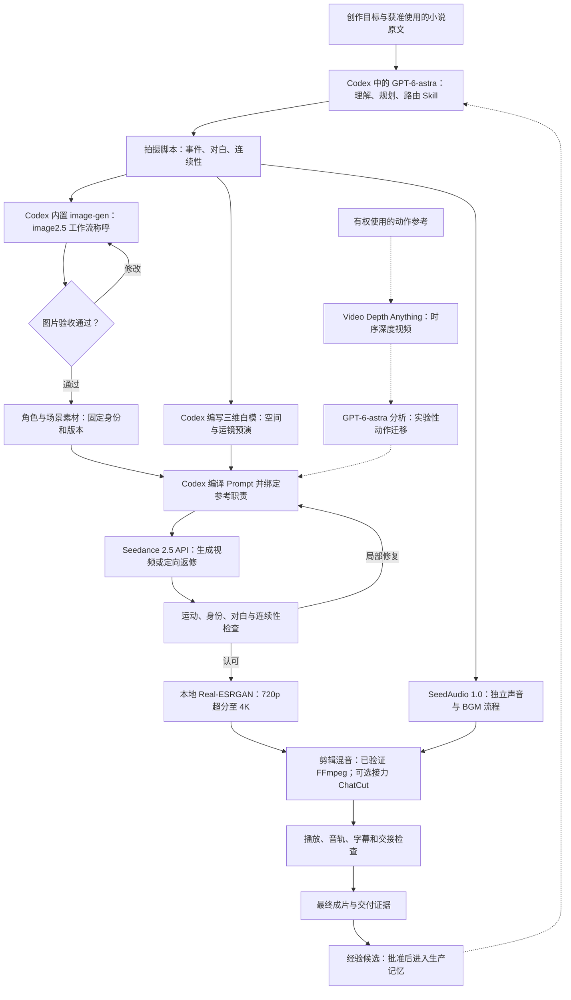

<p align="center"><a href="README.md">English</a></p>

<p align="center">
  
</p>

<h1 align="center">OpenDramaFlow</h1>

<p align="center">你来讲故事，Codex 来组织制作。<br />面向 Windows 的 Codex 原生、本地优先视频生产框架。</p>

<p align="center">
  
  
  
  
</p>

<p align="center"><a href="#实际作品">实际作品</a> · <a href="#agent-如何完成制作">制作流程</a> · <a href="#现在的工作台">工作台</a> · <a href="#安装">安装</a> · <a href="#目前的不足">不足与边界</a></p>

直接在 Codex 对话里表达创作目标，由 Agent 组织规划、专业 Skill、模型调用、素材、剪辑与复核。画布展示生产成果与关联，**不要求用户手动添加、连接各种节点**。

## 实际作品

**[《从姑获鸟开始》城寨风云篇 · 第一集｜前往小红书观看](https://www.xiaohongshu.com/discovery/item/6aa5351d0000000028029cea)**

[](https://www.xiaohongshu.com/discovery/item/6aa5351d0000000028029cea)

创作者：**欧五花八蒙**。这是实际项目的制作成果，也保留了当前技术的不足；不是“一键生成、首轮即合格”的承诺。小红书可能要求登录或使用 App。作品链接由创作者提供，本次文档更新未独立完整播放线上正片。

### 先看几秒制作效果


从既有片头选取城寨 → 拳台 → 锁链三段，共六秒。动图为轻量无声预览，不能用于评价原视频画质；完整叙事、声音和剪辑效果请看上面的第一集。

[720p 环境镜头](production/publish-examples/ending-720p-4s.mp4) · [同镜头 4K 超分对照](production/publish-examples/ending-upscaled-4k-4s.mp4) · [可下载样例与来源](production/publish-examples/README.md)

README 用 **GIF 展示动态效果、Mermaid 展示流程图**，MP4 保留普通播放／下载链接，不把视频塞进 SVG 冒充内嵌播放器。**4K 来自后期超分，不是 Seedance 原生 4K。** 完整正片、小说原文和第三方电影不随仓库发布。

## Agent 如何完成制作

下面是创作者正在迭代的制作方法。Harness 提供可追踪的状态与工具，Codex 负责组织执行；独立工具和实验路线不等于全部已内置为 MCP 服务。



1. **先确定视觉素材。** 创作者把当前图片流程称为 **image2.5**，历史记录中也有 **image2**；这些称呼不代表插件能保证或指定某个固定 API 模型 ID。默认使用当前 Codex 会话内置图片工具，展示候选，验收后写入项目素材库。只有用户明确要求或内置工具确实失败／不可用才回退到项目图片模型。
2. **先导演，再生成。** GPT-6-astra 是创作者选用的 Codex 模型，不是插件硬编码的必选模型。Agent 根据原文写拍摄脚本，再编写三维场景和摄影机代码，由 Three.js 等渲染出白模视频，统一空间、站位、运镜和节奏；不是大语言模型直接输出视频，也不代表精细打斗已经可控。
3. **按职责交付参考。** Codex 把自己编写的 Prompt 和图片、视频、音频、首尾帧等参考通过接口交给 **Seedance 2.5（SD2.5）**。外观、动作、运镜、声音各自分工；问题只修对应镜头，保护已认可内容。
4. **声音按需独立制作。** **SeedAudio 1.0（用户称 SD audio1.0）** 是独立声音／BGM 路线，第一集已有实际音乐生成记录。合适时保留 Seedance 原生对白和环境声，不是所有声音都重新生成；目前尚未成为插件的通用音乐 MCP 适配器。
5. **从生成走到成片。** 当前 2.5 适配器配置最高输出 720p，再由本地 Real-ESRGAN 辅助超分到 4K。ChatCut 是创作者希望采用的可选剪辑接力；当前可核验的第一集包装使用 FFmpeg。ChatCut 需要另装插件、配置对应服务，不属于本项目已打包的一键内置功能。

### 实际使用到的两个开源模型

| 开源项目 | 在流程中的作用 | 不能混淆的边界 |
| --- | --- | --- |
| [Real-ESRGAN](https://github.com/xinntao/Real-ESRGAN) | 本地画面修复与超分；制作使用了 [ncnn Vulkan 版本](https://github.com/xinntao/Real-ESRGAN-ncnn-vulkan) | 放大后的 4K 不等于原生 4K，也不保证恢复真实细节。 |
| [Video Depth Anything](https://github.com/DepthAnything/Video-Depth-Anything) | 把视频参考转成具有时序一致性的深度估计 | 深度不是骨架，不会自动解决双人接触，也不等于训练好了动作迁移模型。 |

工具和权重需要单独安装，并遵守上游许可。另见[模型来源与复现说明](docs/reference-sources.md)。

<details>
<summary>可直接试用的原创白模机位参考：视频与可编辑源码</summary>


[下载视频、查看源码与使用方法](production/publish-examples/whitebox-camera/README.md)。这是已有的 Three.js 空间与摄影机路径实验，不是电影深度衍生素材，也不代表已完成动作捕捉。

</details>

## 现在的工作台

以下为 **2026-09-14 使用真实工作台数据重新截取**的界面。画布交互在创作页的隔离副本中验证，避免修改正式项目布局；没有注入虚构示例。截图是当时状态，不代表所有显示的生产条目都已经验收。

**项目库：管理作品、创作页和素材。**


**无限画布：查看真实产物与关联，对话仍在 Codex 中。**


画布已接入 [infinite-canvas](https://github.com/basketikun/infinite-canvas) 的原生 React + TypeScript 组件，按 MIT 许可保留署名：平移缩放、媒体节点、选中轮廓、尺寸调整、连线及小地图。仅画布使用 React，项目管理、Skill、已批准素材版本和 Node/MCP 制作框架仍是我们自己的。图片完整呈现，视频按需加载，文件沿用现有预览器。这是限定范围的组件集成，不是整套产品一比一克隆。截图展示《留一盏灯》创作页，不是第一集成片验收。[组件来源与构建说明](plugins/ai-drama-studio/ui/README.md) · [更新记录、新增方法技能与网盘分发建议](docs/canvas-refresh-20260914.md)。

<details>
<summary>专业 Skill：可独立折叠的目录与可阅读的完整指引</summary>


</details>

## 目前的不足

- **打斗仍然是这次案例最弱的一环。** 快速攻防、抓握、遮挡、重心转移和左右肢体归属仍会出错。创作者尝试从真实电影武打镜头提取时序深度，再由 GPT-6-astra 分析、尝试迁移；目前效果仍差强人意，尚未实现端到端骨骼动捕迁移与可靠双人接触求解。
- **白模更适合空间和运镜，不适合承诺精确动作。** 早期动作预演存在变形、穿模，甚至影响最终质量；视频参考是软约束，不是物理约束。
- **输入功能覆盖不等于生成质量全覆盖。** 多参考、续写、编辑仍受账号权限、模型行为和素材条件影响；局部编辑也可能改动原本要求保留的内容。
- **外围步骤尚未全部产品化。** SeedAudio 音乐、深度分析、本地超分和 ChatCut 接力需要独立配置；当前有证据的确定性后期是 FFmpeg。
- **长片仍需要判断与审核。** ASR、抽帧、解码通过不能代替正常速度看听、字幕检查和成片验收；显存、磁盘、云端调用费用也是真实成本。
- **本地动作库不是可直接公开的数据集。** 收集的电影／教学原片及深度衍生文件尚无已核实的再分发许可。仓库只提供明确整理的样例，参见[公开素材范围](production/publish-examples/README.md#publication-boundary)。

## 它负责什么

创作目标 → 已批准上下文 → 场次与镜头合同 → 明确用途的参考素材 → 有调用边界的任务 → 版本化素材 → 剪辑与复核 → 交付证据。

- **47 个内置 Skill**：总控加 46 个专业技能，覆盖小说前期、Seedance 提示词、连续性和后期等；自然语言、显式名称及启用开关共用目录。
- **一个 IP 一个项目**：分卷／季度、独立创作页、文件夹素材库；移动与重命名不改变资产身份，已用版本不被自动替换。
- **Codex 对话 + 无限画布**：对话留在 Codex，工作台展示真实产物、预览、播放和生产关系。
- **可恢复执行**：保存请求摘要、素材版本、调用上限、供应商任务 ID；提交状态未知时先核对原任务，不盲目重复付费。
- **分层记忆**：候选提炼与生产事实分开，批准后才能进入可信上下文；单个项目经验不自动覆盖其他作品。
- **有证据的后期**：保护认可片段、检查真实切点、字幕只映射一次；技术检查与实际看听分开记录。

## 安装

需要 Windows、Codex Desktop／CLI、Node.js 20+、npm、FFmpeg。生成需要自备服务商凭据，费用由服务商收取。

克隆仓库，在 Codex 中打开后可直接说：

> 用 scripts/install.ps1 安装这个仓库的 OpenDramaFlow 插件。检查依赖与本地市场，验证技能和 MCP，不进行付费生成。不要打断其他正在制作的任务。

也可以在仓库运行：

```powershell
powershell -ExecutionPolicy Bypass -File .\scripts\install.ps1
```

安装器可补齐缺失依赖并注册本地插件市场。升级时若工作台正在使用，会停止安装以保护缓存；先完成活动任务再依照提示升级。更新后新开任务或重启 Codex：磁盘文件更新不等于当前任务已热加载。

工作台 **API Key** 页面配置方舟 Key；豆包语音 Key 可选。凭据使用 Windows DPAPI 保管，不提交 Git，也不通过 MCP 明文返回。

仅调试网页时：

```powershell
cd plugins\ai-drama-studio
npm ci
npm start
```

打开[本地工作台](http://127.0.0.1:4317)。仅启动 HTTP 不等于 Codex 已挂载 MCP 插件。

## 模型与工具：已接入和未接入分开

| 能力 | 当前状态与边界 |
| --- | --- |
| 图片素材 | 默认当前 Codex 内置图片生成工具；候选验收后入库。仅项目明确委托时可由 Agent 检查，不能把“自动模式”当作委托。内置工具确实不可用或用户明确要求时才用项目图片模型。 |
| Seedance 2.5 | 文生视频、首帧、首尾帧、多模态参考、视频续写、源视频编辑；图片／视频／音频引用职责、原生声音显式开关。 |
| 参数合同 | 本地 2.5 配置校验最多 30 图、10 视频、10 音频参考及 4–30 秒生成；首帧类跟随素材比例，视频编辑使用 adaptive 比例和 duration=-1。实际账号权限、接口与素材限制仍须验证。 |
| 素材送达 | 本地已登记素材转换为模型可访问的 HTTPS 或 Ark 资产引用；按需暴露素材，不公开整个库。 |
| ASR／标准 TTS | 已接入可选豆包语音凭据。没有语音 Key 时采用 Seedance 原生声音方案；独立识别／配音不可用时明确报告，不伪造结果。 |
| FFmpeg | 本地组片、媒体检查与交付证据；MCP 不可用时，可对已认可文件执行有记录的确定性后期，不能假称已回写 MCP。 |
| SeedAudio 1.0 | 第一集通过独立制作脚本生成了已认可音乐；**尚未成为通用音乐生成 MCP 适配器**。 |
| Video Depth Anything | 已用于插件外深度参考实验。深度图不是骨架、身份模型或动作捕捉。 |
| Real-ESRGAN | 已做本地超分实践并提供对照；不是 Seedance 原生分辨率选项，也不是已内置的一键推理服务。 |

[Seedance 历史验证记录](docs/seedance-2.5-validation.md)按日期保留证据。支持输入不保证身份、运动、声音和编辑效果完全正确；视频编辑是生成式修改，不是像素精确的遮罩编辑。声音克隆、专业剪辑软件工程导出仍未接入。

## 自动执行不等于自动宣布合格

默认自动执行受当前目标与冻结调用上限约束；手动模式保留可信审批，两者都不能改变 Codex 宿主权限。

图片验收、生产记忆批准、视频质量复核是不同环节。明确委托只对对应项目与范围有效，不能把 Agent 检查记成用户逐图看过。API 成功、ASR 文本、抽帧、解码通过，各自只证明对应事实。

第一集沉淀的重点是：

- 每镜明确事件、空间状态和下一镜交接。
- 左右肢体按角色自身定义，核对接触、视线、伤势与道具。
- 局部失败局部修复，保留已认可内容。
- 以真实切点和帧区间处理字幕、对白及包装偏移。
- 分别记录技术通过、实际看听、用户认可与待验项目。

项目案例位于总控的分项目参考中，不是所有视频必须套用的风格或剧情。

[SkillOpt 小规模实验](production/publish-examples/skillopt-evaluation/README.md)：现有规则最终合成决策题 4/4 通过，未产出补丁，保留原技能，**没有观察到优化收益，也不代表视频质量提升**。仓库提供输入、可迁移脚本和脱敏结果。

## 数据与公开范围

默认状态目录：`%LOCALAPPDATA%\OpenDramaFlow\data`。

- `AI_DRAMA_DATA_DIR` 改变状态根目录。
- `AI_DRAMA_MEDIA_DIR` 可为**新**上传、生成和编辑媒体指定独立目录。
- 不自动迁移已有绝对路径；先复制、核验哈希、更新引用，再移除原件。
- 删除项目时，外部媒体保留原位，并在本地回收区保存引用恢复清单。
- 私人 `production/`、下载参考、模型检出与日志不上传；只公开明确整理的 `production/publish-examples/`。

软件许可证不授予小说、电影、音乐、肖像或第三方模型权重的权利。素材使用与再分发资格需单独确认。

## 开发与验证

```powershell
cd plugins\ai-drama-studio
npm run check
npm test
node scripts/sync-skill-manifest.mjs --check
node scripts/verify-skill-mcp.mjs
```

MCP 验证启动独立临时进程，检查技能目录与路由，**不调用付费模型**。传入安装目录可验证缓存副本；这仍不等于新 Codex 任务已完成会话内直连检查。

[本轮迭代与验证](docs/production-iteration-20260912.md) · [模型／参考来源](docs/reference-sources.md) · [工作约定](AGENTS.md) · [插件说明](plugins/ai-drama-studio/README.md) · [MIT 软件许可](LICENSE)
